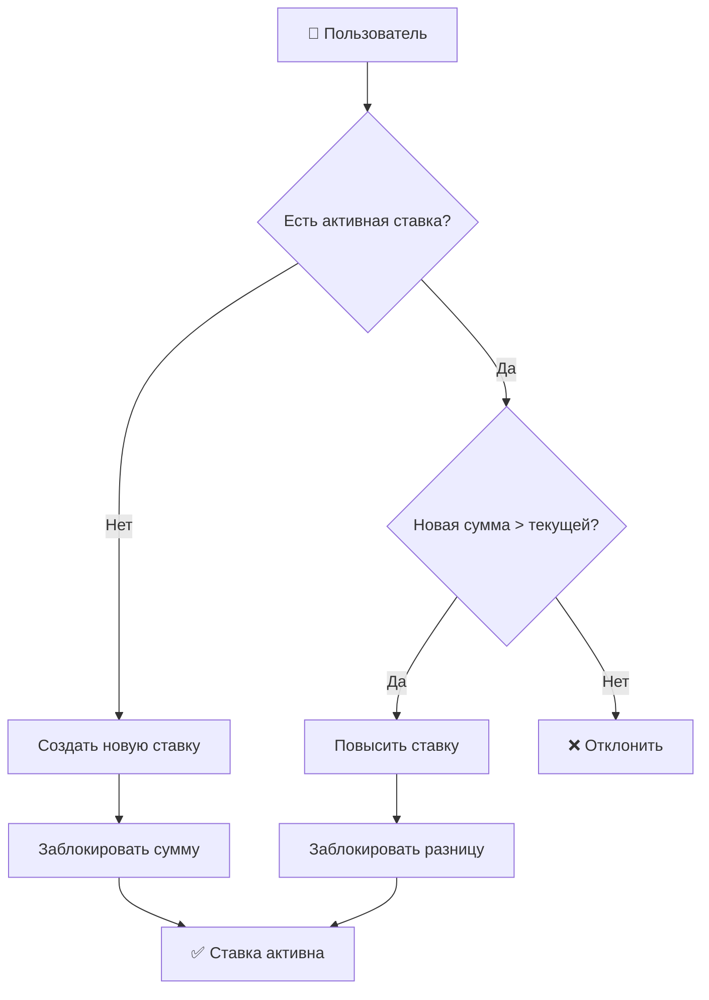
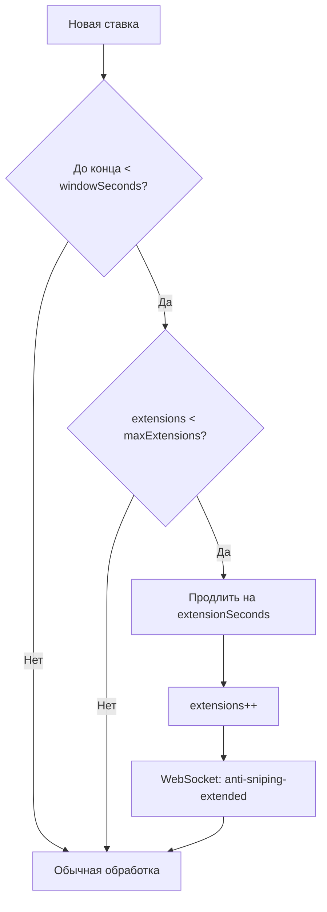
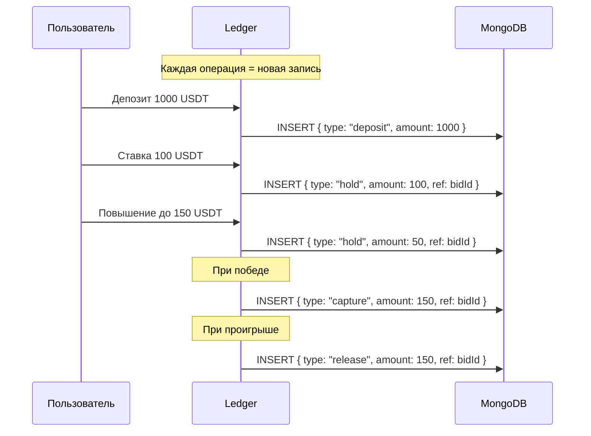

# 🎯 Механика Telegram Gift Auctions: Наш анализ и реализация

> Этот документ описывает наше понимание механики Telegram Gift Auctions, принятые допущения и архитектурные решения.

---

## 📋 Содержание

- [Исследование продукта](#исследование-продукта)
- [Многораундовая система](#многораундовая-система)
- [Модель ставок](#модель-ставок)
- [Anti-Sniping механизм](#anti-sniping-механизм)
- [Финансовая модель](#финансовая-модель)
- [Edge Cases](#edge-cases)
- [Наши допущения](#наши-допущения)
- [Отличия от конкурентов](#отличия-от-конкурентов)

---

<a id="исследование-продукта"></a>
## 🔍 Исследование продукта

### Источники информации

Для понимания механики мы изучили:

1. **Официальные анонсы Telegram** о Gift Auctions
2. **Статьи и обзоры** (membertel.com/blog/telegram-gift-auctions/)
3. **Паттерны поведения** реальных аукционов
4. **Сравнение с классическими аукционами** (eBay, Sotheby's и др.)

### Ключевые выводы

| Аспект | Классический аукцион | Telegram Gift Auction |
|--------|---------------------|----------------------|
| **Структура** | Один дедлайн | Множество раундов |
| **Победители** | Один победитель | Частичные победители в каждом раунде |
| **Проигравшие** | Ставки отменяются | Ставки переносятся в следующий раунд |
| **Anti-sniping** | Редко | Встроенный механизм |
| **Участие** | Можно выйти в любой момент | Средства заблокированы до победы/окончания |

---

<a id="многораундовая-система"></a>
## 🔄 Многораундовая система

### Концепция

Telegram Gift Auction — это не классический аукцион "победитель забирает всё", а **система поэтапного распределения** лимитированных товаров.

```
┌─────────────────────────────────────────────────────────────────┐
│                     АУКЦИОН: 100 NFT                            │
├─────────────────────────────────────────────────────────────────┤
│                                                                 │
│  ┌─────────────┐    ┌─────────────┐    ┌─────────────┐         │
│  │  Раунд 1    │    │  Раунд 2    │    │  Раунд 3    │         │
│  │  30 NFT     │───▶│  40 NFT     │───▶│  30 NFT     │         │
│  │  2 минуты   │    │  2 минуты   │    │  2 минуты   │         │
│  └─────────────┘    └─────────────┘    └─────────────┘         │
│        │                  │                  │                  │
│        ▼                  ▼                  ▼                  │
│   Топ-30 ставок      Топ-40 ставок     Топ-30 ставок          │
│   = победители       = победители      = победители           │
│                                                                 │
│   Остальные ─────▶ Остальные ─────▶ Возврат средств           │
│   переносятся      переносятся                                 │
│                                                                 │
└─────────────────────────────────────────────────────────────────┘
```

### Логика распределения

1. **Раунд начинается** в запланированное время
2. **Участники делают ставки** или повышают существующие
3. **Раунд завершается** (с возможными anti-sniping продлениями)
4. **Топ-N участников** получают товары (N = количество товаров в раунде)
5. **Средства победителей** списываются
6. **Проигравшие** автоматически переходят в следующий раунд с текущей ставкой
7. **В последнем раунде** оставшиеся ставки возвращаются

### Почему такая система?

| Преимущество | Описание |
|--------------|----------|
| **Поддержание интереса** | Участники остаются вовлечены на протяжении всего аукциона |
| **Справедливость** | Больше шансов получить товар при продолжении участия |
| **Ликвидность** | Средства остаются в системе до финала |
| **Динамика** | Каждый раунд — это новый шанс |

---

<a id="модель-ставок"></a>
## 💰 Модель ставок

### Одна ставка на пользователя



### Правила ставок

1. **Одна активная ставка** на аукцион на пользователя
2. **Только повышение** — нельзя понизить ставку
3. **Мгновенная блокировка** — средства блокируются сразу
4. **Инкрементальная блокировка** — при повышении блокируется только разница

### Пример

```
Баланс пользователя: 1000 USDT

Действие 1: Ставка 100 USDT
├── Баланс: 1000 → 900
├── Заблокировано: 0 → 100
└── Активная ставка: 100

Действие 2: Повышение до 150 USDT
├── Баланс: 900 → 850
├── Заблокировано: 100 → 150
└── Активная ставка: 150

Действие 3: Попытка понизить до 120 USDT
└── ❌ ОТКЛОНЕНО: нельзя понижать ставку

Результат раунда: Проигрыш
├── Ставка переносится в следующий раунд
└── Средства остаются заблокированы (150)

Результат финала: Проигрыш
├── Заблокировано: 150 → 0
└── Баланс: 850 → 1000 (возврат)
```

---

<a id="anti-sniping-механизм"></a>
## ⏰ Anti-Sniping механизм

### Проблема sniping

**Sniping** — стратегия размещения ставки в последние секунды/миллисекунды аукциона, чтобы конкуренты не успели ответить.

```
Без anti-sniping:
┌────────────────────────────────────────────────┐
│ Раунд                              Конец      │
│ ═══════════════════════════════════════│      │
│                                    ↑          │
│                              Ставка бота      │
│                              (последняя мс)   │
│                                               │
│ Другие участники не успевают ответить! ❌     │
└────────────────────────────────────────────────┘
```

### Наше решение: Soft Close

```
С anti-sniping:
┌────────────────────────────────────────────────────────────┐
│ Раунд                    │ Anti-sniping │    Продление    │
│ ═════════════════════════│══════════════│═════════════════│
│                          ↑              ↑                  │
│                    30 сек до        Ставка =              │
│                    конца            продление             │
│                                                           │
│ Другие участники получают шанс ответить! ✅               │
└────────────────────────────────────────────────────────────┘
```

### Конфигурация

| Параметр | Описание | По умолчанию |
|----------|----------|--------------|
| `antiSnipingWindowSeconds` | Окно детекции (последние N секунд) | 30 |
| `antiSnipingExtensionSeconds` | Продление при ставке в окне | 30 |
| `maxAntiSnipingExtensions` | Максимум продлений | 5 |

### Логика



### Почему это важно?

| Без anti-sniping | С anti-sniping |
|------------------|----------------|
| Боты доминируют | Честная конкуренция |
| Участники разочарованы | Вовлечённость растёт |
| Низкие финальные цены | Рыночные цены |

---

<a id="финансовая-модель"></a>
## 💳 Финансовая модель

### Ledger-first подход

Все движения средств записываются в **append-only журнал**:



### Типы операций

| Тип | Описание | Влияние на баланс |
|-----|----------|-------------------|
| `deposit` | Пополнение | balance ↑ |
| `hold` | Блокировка под ставку | balance ↓, frozen ↑ |
| `capture` | Списание при победе | frozen ↓ |
| `release` | Возврат при проигрыше | frozen ↓, balance ↑ |
| `withdrawal_request` | Запрос вывода | balance ↓, frozen ↑ |
| `withdrawal_complete` | Вывод завершён | frozen ↓ |

### Инварианты

```
Для каждого пользователя в любой момент времени:

1. balance >= 0
2. frozen >= 0
3. sum(active_holds) == frozen
4. sum(deposits) - sum(captures) - sum(withdrawals) == balance + frozen
```

### Идемпотентность

Каждая операция имеет `idempotencyKey`:

```javascript
// Первый вызов
await ledger.hold({ userId, amount: 100, idempotencyKey: "bid-123-v1" });
// → Создаёт запись, возвращает holdId

// Повторный вызов с тем же ключом
await ledger.hold({ userId, amount: 100, idempotencyKey: "bid-123-v1" });
// → Возвращает тот же holdId, без создания новой записи

// Вызов с тем же ключом, но другой суммой
await ledger.hold({ userId, amount: 200, idempotencyKey: "bid-123-v1" });
// → 409 Conflict
```

---

<a id="edge-cases"></a>
## 🔧 Edge Cases

### 1. Одновременные ставки

**Проблема**: Два запроса на ставку от одного пользователя одновременно.

**Решение**: Распределённая блокировка в Redis.

```
Request 1: SETNX lock:user:auction → SUCCESS → обработка
Request 2: SETNX lock:user:auction → FAIL → 409 Conflict
```

### 2. Равные ставки

**Проблема**: Две ставки с одинаковой суммой.

**Решение**: Детерминированное ранжирование:
1. Сумма (DESC)
2. Время создания (ASC) — кто раньше, тот выше
3. ID ставки (ASC) — для полной детерминированности

### 3. Недостаточно участников

**Проблема**: В раунде меньше ставок, чем товаров.

**Решение**: Все участники с валидными ставками побеждают.

### 4. Сбой во время финализации

**Проблема**: Сервер падает в процессе расчёта победителей.

**Решение**:
1. Распределённая блокировка с TTL
2. Идемпотентные операции
3. Возможность перезапуска финализации

### 5. Ставка в момент закрытия раунда

**Проблема**: Ставка отправлена за 1ms до закрытия.

**Решение**: 
- Если успела до закрытия — принята
- Если раунд уже closed — отклонена с 400

### 6. Переполнение anti-sniping

**Проблема**: Боты бесконечно продлевают раунд.

**Решение**: `maxAntiSnipingExtensions` ограничивает продления.

---

<a id="наши-допущения"></a>
## 📝 Наши допущения

### Подтверждённые (из анализа)

| Допущение | Уверенность | Источник |
|-----------|-------------|----------|
| Многораундовая система | ✅ Высокая | Официальные анонсы |
| Перенос ставок между раундами | ✅ Высокая | Статьи и обзоры |
| Anti-sniping существует | ✅ Высокая | Упоминания в документации |

### Интерпретированные (наш выбор)

| Допущение | Обоснование |
|-----------|-------------|
| **Одна ставка на аукцион** | Упрощает UX, предотвращает самоперебивание |
| **Мгновенная блокировка** | Гарантия платёжеспособности |
| **Нельзя понижать ставку** | Предотвращает манипуляции |
| **Детерминированный tiebreaker** | Прозрачность и проверяемость |
| **Продление = фиксированное время** | Проще понять для пользователей |

### Неизвестные (требуют уточнения)

| Аспект | Наш выбор | Альтернатива |
|--------|-----------|--------------|
| Минимальный шаг ставки | Нет ограничения | Фиксированный % |
| Минимальная ставка | На уровне аукциона | Глобальная |
| Уведомления о перебитии | Мгновенные | Батчами |

---

<a id="отличия-от-конкурентов"></a>
## 🏆 Отличия от конкурентов

### Уникальные фичи нашей реализации

| Фича | Мы | Другие |
|------|-----|--------|
| **Merkle-корни ставок** | ✅ | ❌ |
| **Подписи раундов** | ✅ | ❌ |
| **Replay эндпоинты** | ✅ | ❌ |
| **Ledger append-only** | ✅ | Поля в User |
| **Прокси-ставки** | ✅ | ❌ |
| **Микросервисы** | ✅ | Монолит |
| **KMS интеграция** | ✅ | ❌ |
| **3 wallet strategies** | ✅ | 1-2 |

### Криптографическая проверяемость

```
Наш подход:
1. Собираем все ставки раунда
2. Строим Merkle Tree
3. Подписываем корень + результаты
4. Любой может верифицировать

Результат:
- Невозможно изменить историю
- Прозрачность для всех участников
- Доказуемая честность
```

### Финансовая надёжность

```
Другие проекты:              Наш проект:
User.balance = 1000          Ledger entries:
User.frozen = 100            - deposit: +1000
                             - hold: -100
                             
При сбое:                    При сбое:
Состояние может быть         Можно восстановить
несогласованным              из журнала
```

---

## 📊 Резюме

Наша реализация фокусируется на:

1. **Глубоком понимании** механики Telegram Gift Auctions
2. **Криптографической проверяемости** всех результатов
3. **Финансовой надёжности** через ledger-first подход
4. **Масштабируемости** через микросервисную архитектуру
5. **Производственной готовности** с мониторингом и тестами

Мы верим, что эти качества делают нашу систему не просто демонстрацией концепции, а **готовым к production решением**.
