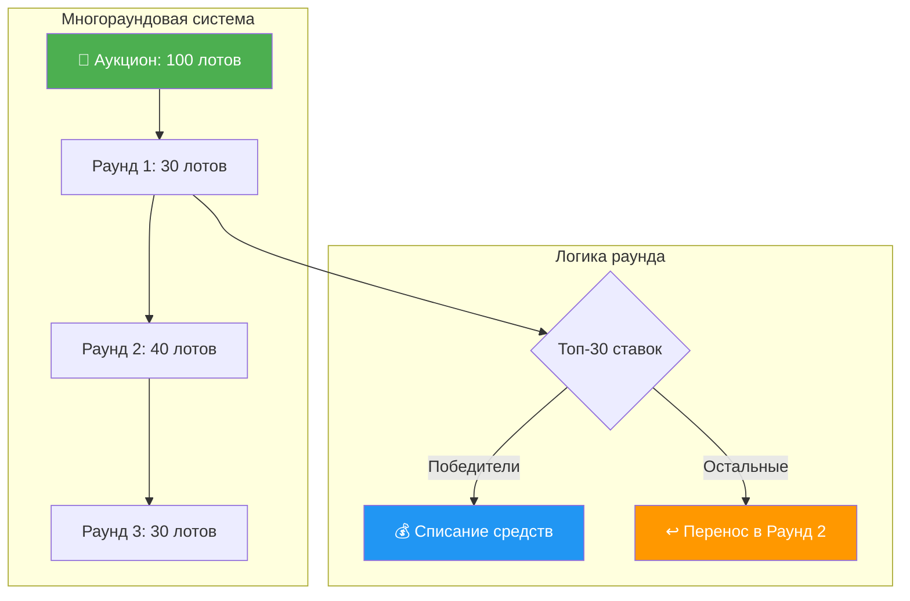
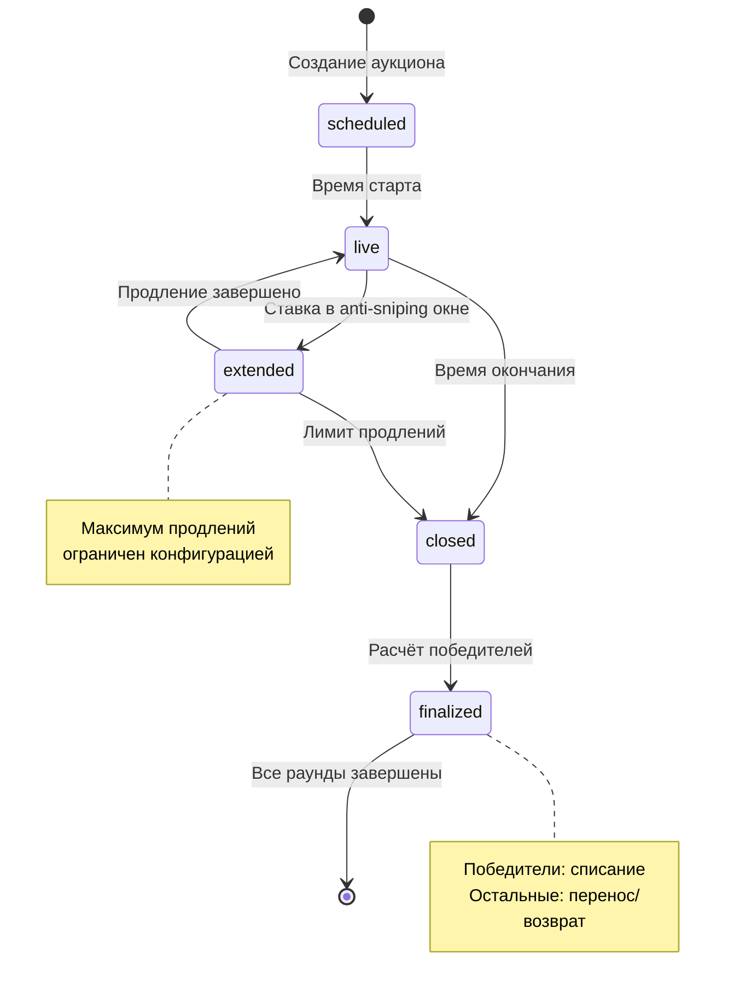
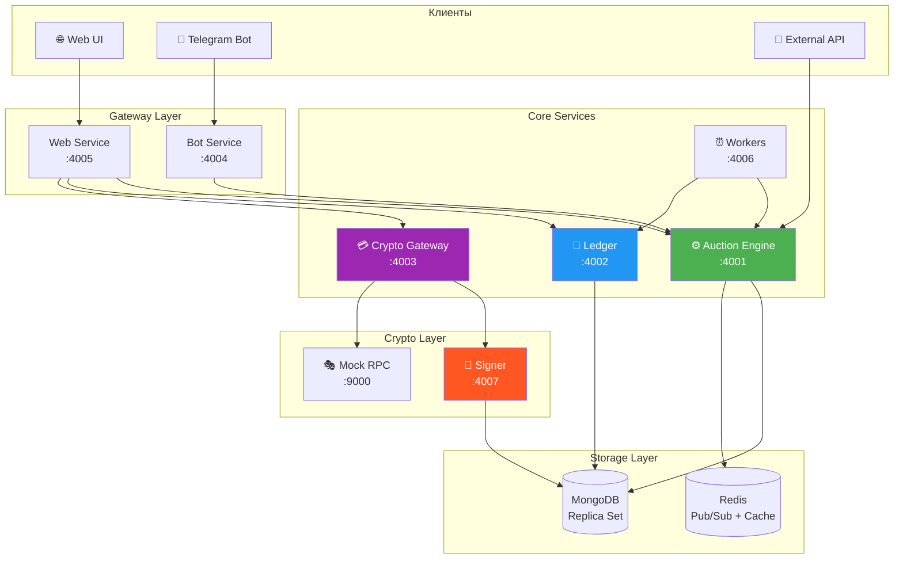
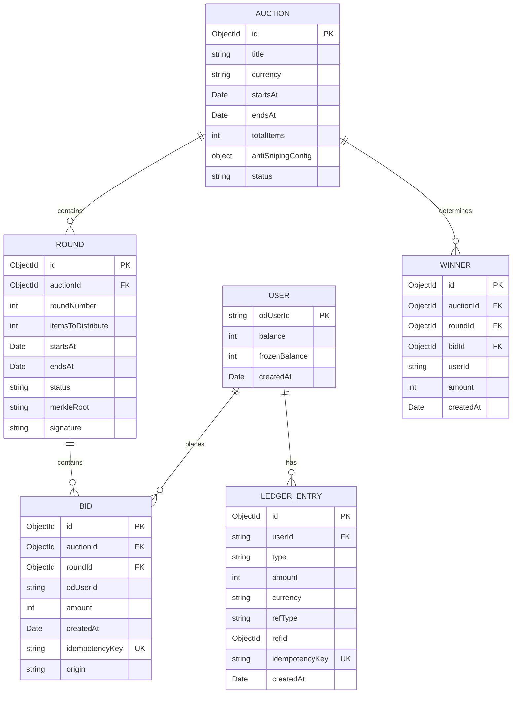
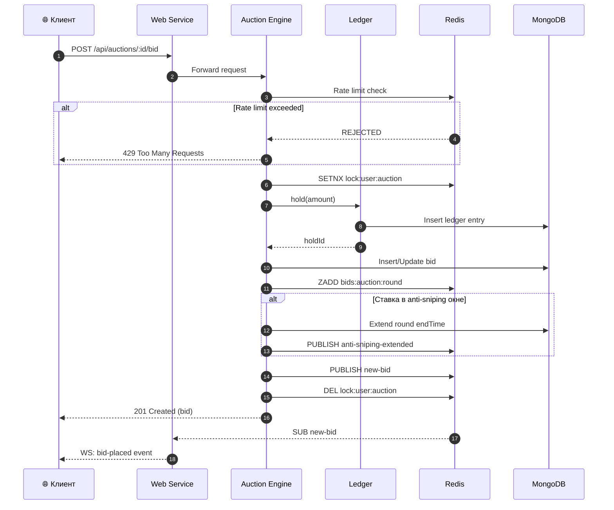
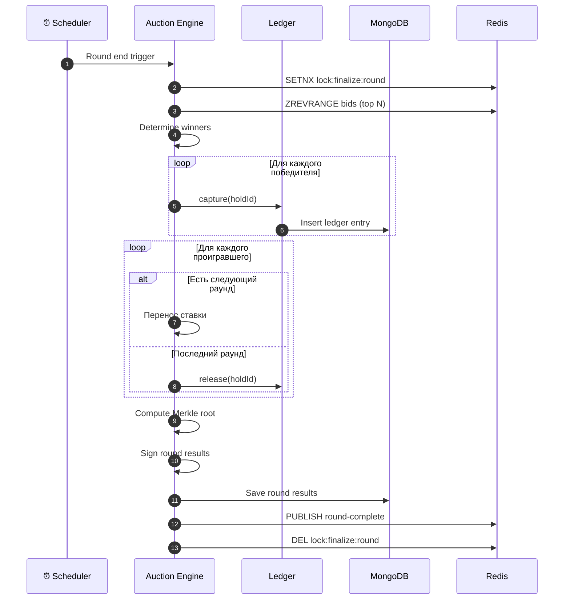
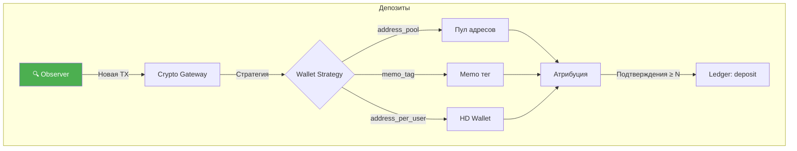
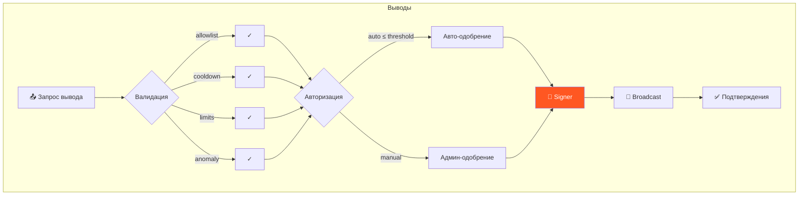
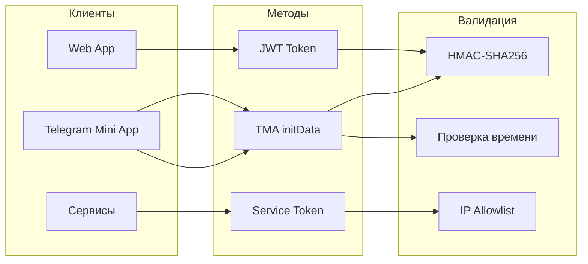

# 🎯 Платформа аукционов Telegram Gift Auctions

> Боевой Telegram-стек для многораундовых крипто-аукционов, рассчитанный на высокую конкуренцию ставок, прозрачные расчёты и мгновенные обновления.

[](https://nodejs.org/)
[](https://www.typescriptlang.org/)
[](https://www.mongodb.com/)
[](https://redis.io/)
[](https://docs.docker.com/compose/)

Движок построен как **ledger-first** система с безопасной конкуренцией: одна активная ставка на аукцион, детерминированное ранжирование и автоматический перенос ставок между раундами.

Это не просто витрина ставок, а полноразмерный расчётный контур: депозиты, блокировки, списания, возвраты и выводы проходят через проверяемый журнал операций с идемпотентностью и строгими контролями безопасности.

Результаты раундов подписываются, строятся Merkle-корни ставок, а replay-эндпоинты позволяют проверить честность и восстановить полную картину раунда.

---

## 📋 Содержание

- [Обзор](#обзор)
- [Гарантии и свойства](#гарантии-и-свойства)
- [Возможности](#возможности)
- [Ключевые механики](#ключевые-механики)
- [Архитектура системы](#архитектура-системы)
- [Сервисы и порты](#сервисы-и-порты)
- [Хранилища данных](#хранилища-данных)
- [Доменные сущности](#доменные-сущности)
- [Ключевые сценарии](#ключевые-сценарии)
- [Быстрый старт](#быстрый-старт)
- [API Reference](#api-reference)
- [Аутентификация и безопасность](#аутентификация-и-безопасность)
- [Конфигурация](#конфигурация)
- [Нагрузочное тестирование](#нагрузочное-тестирование)
- [Наблюдаемость](#наблюдаемость)
- [Диагностика проблем](#диагностика-проблем)

---

## Обзор

В репозитории поставляется полный стек аукционов, разложенный на несколько Node-сервисов. Движок аукционов и журнал операций спроектированы детерминированно и идемпотентно. Крипто-шлюз соединяет депозиты и выводы со внешними наблюдателями и сервисами подписи. Минимальный web-UI и Telegram-бот дают пользователям доступ к опыту.

Платформа закрывает полный жизненный цикл лота: настройка правил, торги, расчёты и выдача выигрыша. Подходит для цифровых активов, ролей и ключей доступа, NFT и любых артефактов, которые можно выдать подтверждением.

Стек рассчитан на плотную конкуренцию ставок: быстрый для пользователя и железобетонный для денег.

Кодовая база делает упор на явную валидацию, строгие схемы и аккуратный контроль конкуренции:
- Все операции, двигающие деньги, пишутся в журнал только на добавление
- Любое видимое клиенту состояние выводится из каноничных записей MongoDB и безопасно кэшируется в Redis
- Все переходы состояния идемпотентны и безопасны к повторным попыткам

---

## Гарантии и свойства

| Гарантия | Описание |
|----------|----------|
| **Детерминированность** | Одинаковые входные данные дают одинаковые итоги и ранжирование |
| **Идемпотентность** | Повторный запрос не приводит к повторному списанию или hold |
| **Полный аудит** | Журнал append-only позволяет восстановить историю по шагам |
| **Проверяемость** | Подписи раундов и Merkle-корни дают независимую верификацию |
| **Безопасная конкуренция** | Распределённые блокировки и лимиты исключают гонки |
| **Устойчивость к сбоям** | Кэши и снапшоты помогают пересинхронизироваться |
| **Изоляция доменов** | Сбой отдельного сервиса не ломает весь расчётный контур |

---

## Возможности

### Честность и проверяемость
- Подписанные результаты раундов
- Merkle-корни ставок
- Replay-эндпоинты для независимой проверки

### Многораундовая динамика
- Перенос ставок между раундами
- Детерминированные правила разруливания равных ставок
- Предсказуемые итоги

### Антиснайпинг
- Умные продления финала
- Жёсткие лимиты на количество продлений
- Защита от пинг-понга

### Прокси-ставки
- Максимум в эскроу
- Авто-повышение по шагу
- Прозрачная логика победы

### Ledger-first финансы
- Блокировки, списания и возвраты фиксируются append-only
- Легко аудируемые операции
- Идемпотентность всех денежных операций

### Гибкие депозиты
- Стратегии: address_pool, memo_tag, address_per_user (HD)
- Точная атрибуция
- Отслеживание подтверждений

### Строгий вывод средств
- Allowlist, cooldown, лимиты
- Детектор аномалий
- Ручное или авто-одобрение
- Подпись и подтверждения

### Realtime
- WebSocket-ленты ставок
- Мгновенные обновления web и бота
- Outbid alerts

---

## Ключевые механики



### Основные принципы

| Механика | Описание |
|----------|----------|
| **Одна ставка на аукцион** | Конкурентные ставки сериализуются и остаются прозрачными |
| **Многораундовое распределение** | Каждый раунд выбирает победителей, остальные переходят дальше |
| **Тайминги раундов** | scheduled → live → closed с антиснайпинг-окнами |
| **Антиснайпинг** | Ставки в последнем окне продлевают раунд с лимитами |
| **Балансы на журнале** | hold/capture/release оформлены append-only записями |
| **Детерминированное ранжирование** | Сумма DESC → createdAt ASC → ID ставки ASC |
| **Прокси-ставки** | Эскроу максимума и авто-повышение |

### Жизненный цикл раунда



---

## Архитектура системы

Система разделена на специализированные сервисы, чтобы домены масштабировались независимо, а сбои локализовались. Ключевые контуры отделены друг от друга: аукционные операции, финансы и крипто-интеграции живут в своих сервисах.



### Ответственность сервисов

| Сервис | Порт | Ответственность |
|--------|------|-----------------|
| **Auction Engine** | 4001 | CRUD аукционов, ставки, снимки раундов, кэш ранжирования |
| **Ledger** | 4002 | Балансы, hold/capture/release, журнал операций |
| **Crypto Gateway** | 4003 | Депозиты, выводы, проверки безопасности |
| **Bot** | 4004 | Telegram-обработчики, уведомления |
| **Web** | 4005 | HTTP API, WebSocket, статика |
| **Workers** | 4006 | Прогресс раундов, финализация |
| **Signer** | 4007 | Подпись транзакций (локальные ключи / KMS) |
| **Mock RPC** | 9000 | Мок наблюдателя и подписанта для разработки |

---

## Сервисы и порты

```
┌─────────────────────────────────────────────────────────────────┐
│                     DOCKER COMPOSE STACK                         │
├─────────────────────────────────────────────────────────────────┤
│                                                                  │
│  ┌──────────────┐  ┌──────────────┐  ┌──────────────┐           │
│  │ Auction      │  │ Ledger       │  │ Crypto       │           │
│  │ Engine       │  │              │  │ Gateway      │           │
│  │ :4001        │  │ :4002        │  │ :4003        │           │
│  └──────────────┘  └──────────────┘  └──────────────┘           │
│                                                                  │
│  ┌──────────────┐  ┌──────────────┐  ┌──────────────┐           │
│  │ Bot          │  │ Web UI       │  │ Workers      │           │
│  │              │  │              │  │              │           │
│  │ :4004        │  │ :4005        │  │ :4006        │           │
│  └──────────────┘  └──────────────┘  └──────────────┘           │
│                                                                  │
│  ┌──────────────┐  ┌──────────────┐                             │
│  │ Signer       │  │ Mock RPC     │                             │
│  │              │  │              │                             │
│  │ :4007        │  │ :9000        │                             │
│  └──────────────┘  └──────────────┘                             │
│                                                                  │
│  ┌──────────────────────────────────────────────────┐           │
│  │                   MongoDB :27017                  │           │
│  │                   (Replica Set)                   │           │
│  └──────────────────────────────────────────────────┘           │
│                                                                  │
│  ┌──────────────────────────────────────────────────┐           │
│  │                   Redis :6379                     │           │
│  │                   (Pub/Sub + Cache)               │           │
│  └──────────────────────────────────────────────────┘           │
│                                                                  │
└─────────────────────────────────────────────────────────────────┘
```

---

## Хранилища данных

### MongoDB
Каноничный источник правды для:
- Аукционов и раундов
- Ставок
- Записей журнала операций
- Выводов
- Уведомлений

### Redis
- Pub/sub в реальном времени
- Ограничения частоты
- Распределённые блокировки
- Кэш ранжирования (Sorted Sets)
- Краткоживущие снимки

### Внешние зависимости
- **Telegram**: init-данные WebApp для аутентификации, Bot API для уведомлений
- **Крипто-наблюдатель**: внешний сервис, фиксирующий входящие транзакции
- **Крипто-подписант**: внешний или внутренний сервис, подписывающий выводы

---

## Доменные сущности



### Описание сущностей

| Сущность | Описание |
|----------|----------|
| **Аукцион** | Конфигурация лота, расписание, правила ставок и антиснайпинга |
| **Раунд** | Окно торгов, набор ставок, результаты и подпись раунда |
| **Ставка** | Сумма, автор, время, ключ идемпотентности и признак происхождения |
| **Запись журнала** | Депозит, hold, capture, release или этап вывода |
| **Депозит** | Наблюдаемая транзакция, подтверждения и привязка к пользователю |
| **Вывод** | Запрос, проверки безопасности, подпись, отправка и подтверждения |

---

## Ключевые сценарии

### Размещение ставки



### Финализация раунда



### Депозиты



### Выводы



---

## Быстрый старт

### Требования

- Node.js 20+
- Docker & Docker Compose
- Git

### Установка и запуск

```bash
# 1. Клонирование репозитория
git clone https://github.com/germanProgq/crypto-hackathon.git
cd crypto-hackathon

# 2. Установка зависимостей
npm install

# 3. Запуск всех сервисов
docker compose up -d

# 4. Проверка статуса
docker compose ps

# 5. Открыть Web UI
open http://localhost:4005
```

### Сборка и тесты

```bash
npm run build
npm test
```

### Минимальный .env для разработки

```env
CORE_API_TOKEN=dev-core-token
CRYPTO_ADMIN_TOKEN=dev-admin-token
SIGNER_API_TOKEN=dev-signer-token
CRYPTO_SIGNER_TOKEN=dev-signer-token
CRYPTO_SUPPORTED_CURRENCIES=USDT
CRYPTO_USD_RATES=USDT:1
CRYPTO_WALLET_STRATEGY=memo_tag
CRYPTO_MEMO_DEPOSIT_ADDRESS=USDT:DEMO_DEPOSIT_ADDRESS
CRYPTO_HOT_WALLET_ADDRESS=USDT:DEMO_HOT_WALLET
CRYPTO_OBSERVER_URL=mock
CRYPTO_SIGNER_URL=mock
WEB_ALLOW_DEMO_USER=true
```

### Проверка работоспособности

```bash
# Health check
curl http://localhost:4001/health/ready

# Создание тестового аукциона
curl -X POST http://localhost:4005/api/auctions \
  -H "Content-Type: application/json" \
  -H "x-demo-user-id: demo-admin" \
  -d '{
    "title": "Test Auction",
    "currency": "USDT",
    "totalItems": 10,
    "rounds": [
      { "itemsToDistribute": 3, "durationSeconds": 120 },
      { "itemsToDistribute": 4, "durationSeconds": 120 },
      { "itemsToDistribute": 3, "durationSeconds": 120 }
    ]
  }'
```

---

## API Reference

### Аукционы

| Метод | Путь | Описание |
|-------|------|----------|
| `GET` | `/api/auctions` | Список аукционов |
| `GET` | `/api/auctions/:id` | Детали аукциона |
| `POST` | `/api/auctions` | Создание аукциона |
| `POST` | `/api/auctions/:id/bid` | Размещение ставки |
| `GET` | `/api/auctions/:id/leaderboard` | Топ ставок |
| `GET` | `/api/auctions/:id/replay` | Replay раунда |

### Баланс

| Метод | Путь | Описание |
|-------|------|----------|
| `GET` | `/api/balance` | Текущий баланс пользователя |
| `GET` | `/api/balance/history` | История операций |

### WebSocket события

```javascript
// Подключение
const ws = new WebSocket('ws://localhost:4005/ws');

// События
ws.onmessage = (event) => {
  const { type, payload } = JSON.parse(event.data);
  
  switch (type) {
    case 'bid-placed':
      // Новая ставка
      break;
    case 'outbid':
      // Вашу ставку перебили
      break;
    case 'round-complete':
      // Раунд завершён
      break;
    case 'anti-sniping':
      // Раунд продлён
      break;
  }
};
```

Полная документация API: [`docs/requests.md`](docs/requests.md)

---

## Аутентификация и безопасность

### Методы аутентификации



### Заголовки аутентификации

| Контекст | Заголовок | Описание |
|----------|-----------|----------|
| Core сервисы | `x-service-token: <CORE_API_TOKEN>` | Межсервисные вызовы |
| Telegram | `Authorization: TMA <initData>` | WebApp аутентификация |
| Demo (dev only) | `x-demo-user-id: <userId>` | Для разработки |
| Admin | `x-admin-token: <CRYPTO_ADMIN_TOKEN>` | Админ-операции |
| Signer | `x-signer-token: <SIGNER_API_TOKEN>` | Подпись транзакций |

### Защитные механизмы

- ✅ **CSRF защита** — проверка Origin для небезопасных методов
- ✅ **Rate Limiting** — на пользователя, аукцион и IP
- ✅ **Distributed Locks** — предотвращение race conditions
- ✅ **Idempotency Keys** — защита от дублирования операций
- ✅ **IP Allowlist** — для критичных сервисов (Signer)
- ✅ **KMS интеграция** — опциональное хранение ключей

### Лимиты

| Тип | Переменная | По умолчанию |
|-----|------------|--------------|
| На пользователя | `RATE_LIMIT_USER_PER_SECOND` | 5 |
| На пользователя в аукционе | `RATE_LIMIT_AUCTION_USER_PER_SECOND` | 3 |
| На IP | `RATE_LIMIT_IP_PER_SECOND` | 20 |

---

## Конфигурация

### Core сервисы

| Переменная | Описание | По умолчанию |
|------------|----------|--------------|
| `NODE_ENV` | development / test / production | development |
| `SERVICE_NAME` | Имя сервиса | - |
| `HTTP_HOST` | Host для биндинга | 0.0.0.0 |
| `HTTP_PORT` | Порт | - |
| `LOG_LEVEL` | fatal / error / warn / info / debug / trace | info |

### Хранилища

| Переменная | Описание |
|------------|----------|
| `MONGO_URI` | MongoDB connection string |
| `MONGO_DB` | Имя базы данных |
| `MONGO_POOL_MAX` | Размер пула подключений |
| `REDIS_URL` | Redis connection string |
| `REDIS_PREFIX` | Префикс ключей Redis |

### Токены

| Переменная | Описание |
|------------|----------|
| `CORE_API_TOKEN` | Обязателен для core сервисов |
| `CRYPTO_ADMIN_TOKEN` | Админ-действия в крипто-шлюзе |
| `SIGNER_API_TOKEN` | Токен подписанта |
| `CRYPTO_SIGNER_TOKEN` | Токен для вызова подписанта |

### Anti-Sniping

| Переменная | Описание | По умолчанию |
|------------|----------|--------------|
| `ANTI_SNIPING_WINDOW_SECONDS` | Окно детекции | 30 |
| `ANTI_SNIPING_EXTENSION_SECONDS` | Продление | 30 |
| `ANTI_SNIPING_MAX_EXTENSIONS` | Максимум продлений | 5 |

### Crypto Gateway

| Переменная | Описание |
|------------|----------|
| `CRYPTO_SUPPORTED_CURRENCIES` | Список валют (USDT) |
| `CRYPTO_WALLET_STRATEGY` | address_pool / memo_tag / address_per_user |
| `CRYPTO_OBSERVER_URL` | URL наблюдателя или `mock` |
| `CRYPTO_SIGNER_URL` | URL подписанта или `mock` |
| `CRYPTO_USD_RATES` | Курсы валют (USDT:1) |

### Выводы

| Переменная | Описание |
|------------|----------|
| `CRYPTO_WITHDRAWAL_MIN_AMOUNT` | Минимальная сумма |
| `CRYPTO_WITHDRAWAL_MAX_AMOUNT` | Максимальная сумма |
| `CRYPTO_WITHDRAWAL_DAILY_LIMIT` | Дневной лимит |
| `CRYPTO_WITHDRAWAL_COOLDOWN_SECONDS` | Cooldown между выводами |
| `CRYPTO_WITHDRAWAL_ALLOWLIST_REQUIRED` | Требовать allowlist |
| `CRYPTO_WITHDRAWAL_AUTO_AUTHORIZE_MAX_AMOUNT` | Порог авто-одобрения |

### Хранение данных

| Переменная | Описание | По умолчанию |
|------------|----------|--------------|
| `RETENTION_BIDS_DAYS` | TTL для ставок | 90 |
| `RETENTION_LEDGER_DAYS` | TTL для журнала | 365 |
| `RETENTION_NOTIFICATIONS_DAYS` | TTL для уведомлений | 30 |

---

## Нагрузочное тестирование

### Доступные сценарии

```bash
# Полный набор тестов
npm run load:all

# Отдельные сценарии
npm run load:bot        # Симуляция ботов
npm run load:stress     # Стресс-тест ставок
npm run load:anti-sniping # Тест anti-sniping
npm run load:reconcile  # Проверка финансовой корректности

# Интерактивный CLI
npm run load:perf
```

### Что проверяют тесты

| Сценарий | Проверка |
|----------|----------|
| **bot-sim** | Конкурентные ставки от множества ботов |
| **stress-bids** | Высокая нагрузка одновременных запросов |
| **anti-sniping** | Корректность продления раундов |
| **reconcile** | Сходимость балансов после раундов |

---

## Наблюдаемость

### Health Endpoints

```bash
# Liveness probe
GET /health/live

# Readiness probe (включает проверки зависимостей)
GET /health/ready

# Prometheus метрики
GET /metrics
```

### Ключевые метрики

- `http_requests_total` — общее количество запросов
- `http_request_duration_seconds` — латентность
- `bids_total` — количество ставок
- `rounds_finalized_total` — завершённые раунды
- `ledger_operations_total` — операции с балансами

Логи в JSON с именем сервиса и окружением.

---

## Диагностика проблем

| Ошибка | Решение |
|--------|---------|
| `CORE_API_TOKEN must be set` | Задайте `CORE_API_TOKEN` в .env |
| `CRYPTO_USD_RATES must include rates` | Задайте `CRYPTO_USD_RATES=USDT:1` |
| `Deposit address pool exhausted` | Укажите `CRYPTO_DEPOSIT_ADDRESS_POOL` или используйте `memo_tag` |
| `CRYPTO_SIGNER_TOKEN must be set` | Укажите `CRYPTO_SIGNER_TOKEN` |
| `Signer token required` или `IP not allowed` | Проверьте `SIGNER_API_TOKEN` и `SIGNER_ALLOWED_IPS` |
| Ошибка подключения к наблюдателю | Проверьте `CRYPTO_OBSERVER_URL` или используйте `mock` |

---

## Мокирование внешних сервисов

### In-process моки

```bash
CRYPTO_OBSERVER_URL=mock
CRYPTO_SIGNER_URL=mock
```

### Сетевой мок (Mock RPC)

Запустите `mock-rpc` и настройте:

```bash
CRYPTO_OBSERVER_URL=http://mock-rpc:9000
CRYPTO_SIGNER_URL=http://mock-rpc:9000
```

Создайте депозит:

```bash
POST http://localhost:9000/mock/observer/mint
{ "currency": "USDT", "address": "ADDR1", "amount": 1 }
```

Увеличьте подтверждения:

```bash
POST http://localhost:9000/mock/observer/mine
{ "blocks": 1 }
```

---

## 📄 Лицензия

MIT License

---

<div align="center">
  <sub>Built with ❤️ for Telegram Gift Auctions</sub>
</div>
