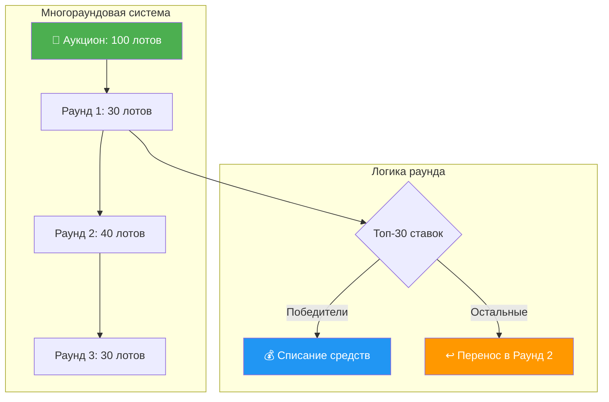
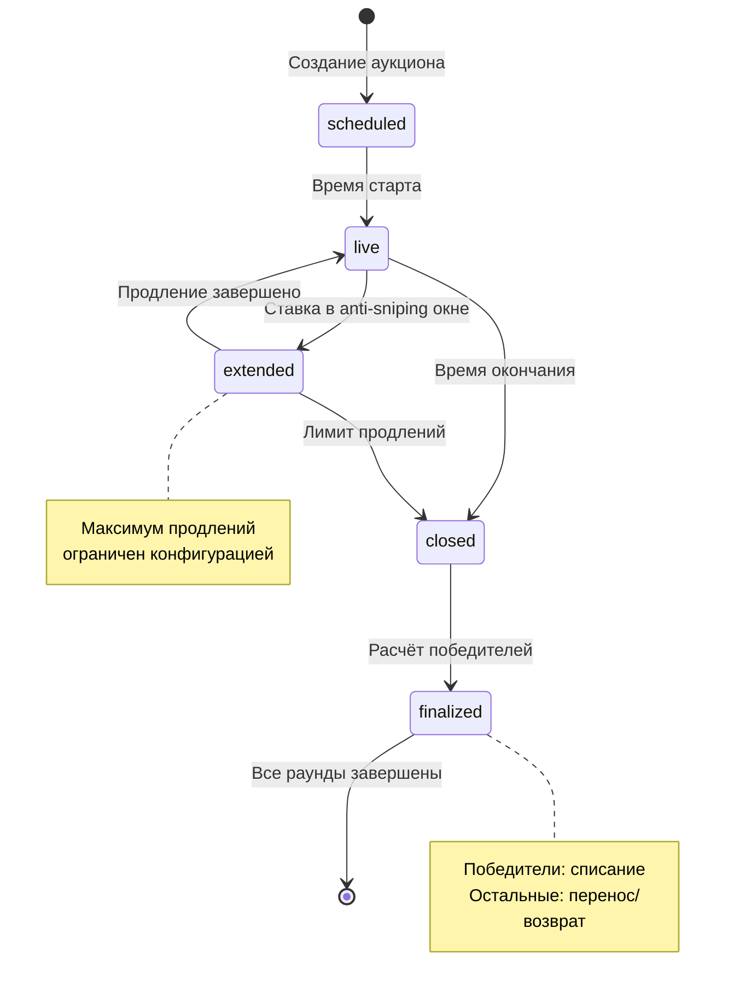
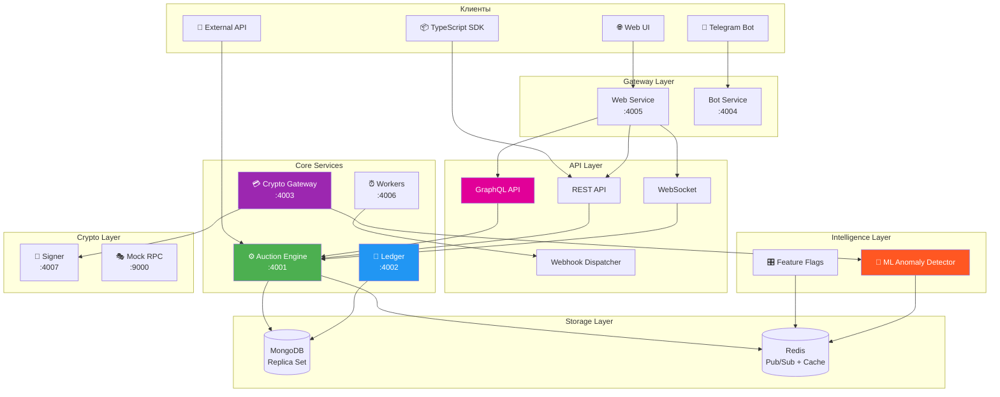
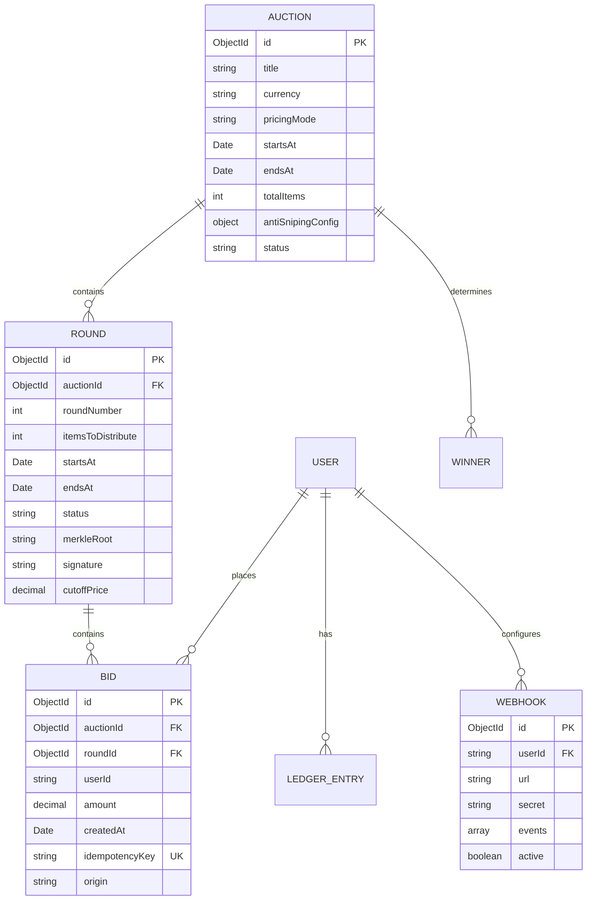
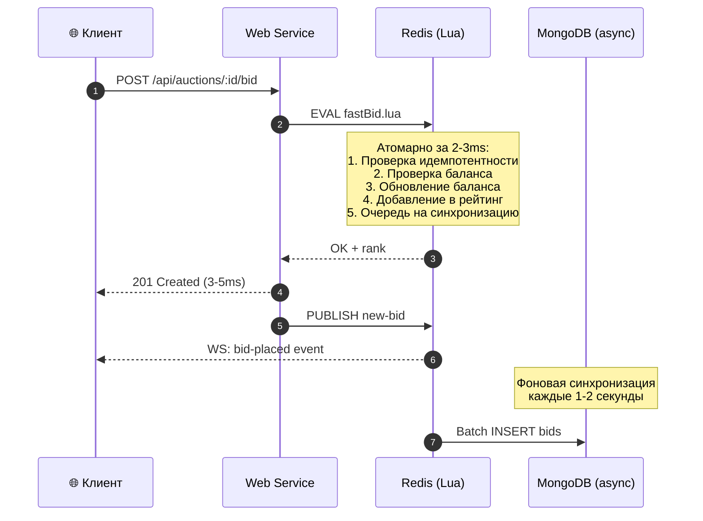
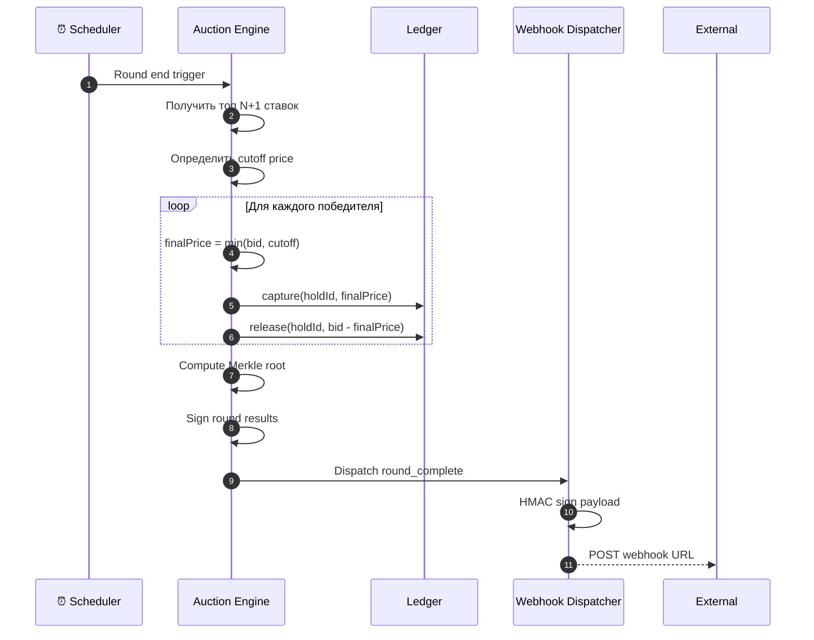

# 🎯 Платформа аукционов Telegram Gift Auctions

> Боевой Telegram-стек для многораундовых крипто-аукционов, рассчитанный на высокую конкуренцию ставок, прозрачные расчёты и мгновенные обновления.

[](https://nodejs.org/)
[](https://www.typescriptlang.org/)
[](https://www.mongodb.com/)
[](https://redis.io/)
[](https://docs.docker.com/compose/)
[](https://graphql.org/)
[](https://swagger.io/)

---

## ✨ Что нового в версии 2.0

| Функция | Описание |
|---------|----------|
| 🚀 **Redis Fast Path** | Lua-скрипт для мгновенных ставок (2000-5000 RPS) |
| 🤖 **ML Детектор аномалий** | Адаптивное обнаружение подозрительных выводов |
| 💰 **Cutoff Pricing** | Vickrey-стиль ценообразования для честных торгов |
| 📊 **GraphQL API** | Гибкие запросы с подписками реального времени |
| 🔔 **Webhook уведомления** | HMAC-подписанные вебхуки для интеграций |
| 🎛️ **Feature Flags** | Динамическое управление функциями через Redis |
| 📈 **Live Dashboard** | Дашборд метрик в реальном времени |
| 📦 **TypeScript SDK** | Автогенерируемый SDK из OpenAPI спецификации |
| 📖 **OpenAPI/Swagger** | Интерактивная документация API |
| 📡 **AsyncAPI** | Документация WebSocket событий |

---

## 📋 Содержание

- [Обзор](#обзор)
- [Гарантии и свойства](#гарантии-и-свойства)
- [Возможности](#возможности)
- [Ключевые механики](#ключевые-механики)
- [Архитектура системы](#архитектура-системы)
- [Сервисы и порты](#сервисы-и-порты)
- [API интерфейсы](#api-интерфейсы)
- [Хранилища данных](#хранилища-данных)
- [Доменные сущности](#доменные-сущности)
- [Ключевые сценарии](#ключевые-сценарии)
- [Быстрый старт](#быстрый-старт)
- [API Reference](#api-reference)
- [GraphQL API](#graphql-api)
- [Webhook интеграция](#webhook-интеграция)
- [Feature Flags](#feature-flags)
- [Аутентификация и безопасность](#аутентификация-и-безопасность)
- [Конфигурация](#конфигурация)
- [Нагрузочное тестирование](#нагрузочное-тестирование)
- [Наблюдаемость](#наблюдаемость)
- [Деплой](#деплой)
- [Диагностика проблем](#диагностика-проблем)

---

## Обзор

Платформа представляет собой полный стек аукционов, разложенный на несколько Node-сервисов. Движок аукционов и журнал операций спроектированы детерминированно и идемпотентно. Крипто-шлюз соединяет депозиты и выводы со внешними наблюдателями и сервисами подписи.

Стек рассчитан на плотную конкуренцию ставок: **быстрый для пользователя и железобетонный для денег**.

### Ключевые принципы

- Все операции, двигающие деньги, пишутся в журнал только на добавление
- Любое видимое клиенту состояние выводится из каноничных записей MongoDB и безопасно кэшируется в Redis
- Все переходы состояния идемпотентны и безопасны к повторным попыткам
- ML-система детектирует аномальные выводы в реальном времени

---

## Гарантии и свойства

| Гарантия | Описание |
|----------|----------|
| **Детерминированность** | Одинаковые входные данные дают одинаковые итоги и ранжирование |
| **Идемпотентность** | Повторный запрос не приводит к повторному списанию или hold |
| **Полный аудит** | Журнал append-only позволяет восстановить историю по шагам |
| **Проверяемость** | Подписи раундов и Merkle-корни дают независимую верификацию |
| **Безопасная конкуренция** | Распределённые блокировки и лимиты исключают гонки |
| **Устойчивость к сбоям** | Кэши и снапшоты помогают пересинхронизироваться |
| **Изоляция доменов** | Сбой отдельного сервиса не ломает весь расчётный контур |
| **ML-защита** | Адаптивное обнаружение аномальных операций |

---

## Возможности

### 🏆 Честность и проверяемость
- Подписанные результаты раундов
- Merkle-корни ставок
- Replay-эндпоинты для независимой проверки
- Cutoff pricing (Vickrey-стиль) — победители платят справедливую цену

### 🔄 Многораундовая динамика
- Перенос ставок между раундами
- Детерминированные правила разруливания равных ставок
- Предсказуемые итоги

### ⏱️ Антиснайпинг
- Умные продления финала
- Жёсткие лимиты на количество продлений
- Защита от пинг-понга

### 🤖 Прокси-ставки
- Максимум в эскроу
- Авто-повышение по шагу
- Прозрачная логика победы

### 💰 Ledger-first финансы
- Блокировки, списания и возвраты фиксируются append-only
- Легко аудируемые операции
- Идемпотентность всех денежных операций

### 🚀 Высокая производительность
- Redis Fast Path: 2000-5000 RPS
- WebSocket Turbo Mode: 3-5ms латентность
- Фоновая синхронизация в MongoDB

### 🤖 ML Детектор аномалий
- Адаптивное обучение на поведении пользователей
- Многофакторная оценка рисков
- Автоматическая блокировка подозрительных выводов

### 🔌 Интеграции
- **GraphQL API** с подписками
- **Webhook уведомления** с HMAC подписями
- **TypeScript SDK** для клиентских приложений
- **OpenAPI/Swagger** документация
- **AsyncAPI** для WebSocket событий

### 🎛️ Feature Flags
- Динамическое управление функциями
- Персонализация для пользователей
- A/B тестирование

---

## Ключевые механики



### Основные принципы

| Механика | Описание |
|----------|----------|
| **Одна ставка на аукцион** | Конкурентные ставки сериализуются и остаются прозрачными |
| **Многораундовое распределение** | Каждый раунд выбирает победителей, остальные переходят дальше |
| **Тайминги раундов** | scheduled → live → closed с антиснайпинг-окнами |
| **Антиснайпинг** | Ставки в последнем окне продлевают раунд с лимитами |
| **Балансы на журнале** | hold/capture/release оформлены append-only записями |
| **Детерминированное ранжирование** | Сумма DESC → createdAt ASC → ID ставки ASC |
| **Cutoff Pricing** | Победители платят цену (N+1)-й ставки + инкремент |

### Жизненный цикл раунда



---

## Архитектура системы



---

## Сервисы и порты

| Сервис | Порт | Ответственность |
|--------|------|-----------------|
| **Auction Engine** | 4001 | CRUD аукционов, ставки, снимки раундов, кэш ранжирования |
| **Ledger** | 4002 | Балансы, hold/capture/release, журнал операций |
| **Crypto Gateway** | 4003 | Депозиты, выводы, ML-детектор аномалий |
| **Bot** | 4004 | Telegram-обработчики, уведомления |
| **Web** | 4005 | HTTP API, GraphQL, WebSocket, статика, Swagger UI |
| **Workers** | 4006 | Прогресс раундов, финализация, вебхуки |
| **Signer** | 4007 | Подпись транзакций (локальные ключи / KMS) |
| **Mock RPC** | 9000 | Мок наблюдателя и подписанта для разработки |

---

## API интерфейсы

```mermaid
flowchart LR
    subgraph "REST API"
        A1[/api/auctions]
        A2[/api/balance]
        A3[/api/deposits]
    end
    
    subgraph "GraphQL"
        G1[Query: auctions]
        G2[Mutation: placeBid]
        G3[Subscription: bidUpdates]
    end
    
    subgraph "WebSocket"
        W1[bid_placed]
        W2[outbid_alert]
        W3[round_complete]
    end
    
    subgraph "Документация"
        D1[Swagger UI<br/>/api/docs]
        D2[AsyncAPI<br/>WebSocket events]
        D3[GraphiQL<br/>/graphiql]
    end
    
    style D1 fill:#85EA2D,color:#000
    style D3 fill:#E10098,color:#fff
```

### Доступные интерфейсы

| Интерфейс | URL | Описание |
|-----------|-----|----------|
| **Swagger UI** | http://localhost:4001/api/docs | Интерактивная документация REST API |
| **GraphiQL** | http://localhost:4005/graphiql | GraphQL IDE с автодополнением |
| **Live Metrics** | http://localhost:4005/live-metrics | Дашборд метрик реального времени |
| **WebSocket** | ws://localhost:4005/ws | Подключение для realtime обновлений |

---

## Хранилища данных

### MongoDB
Каноничный источник правды для:
- Аукционов и раундов
- Ставок
- Записей журнала операций
- Выводов
- Уведомлений
- Конфигурации вебхуков

### Redis
- Pub/sub в реальном времени
- Ограничения частоты
- Распределённые блокировки
- Кэш ранжирования (Sorted Sets)
- Feature Flags
- ML-модели (поведенческие профили)
- Fast Path для ставок

---

## Доменные сущности



---

## Ключевые сценарии

### Размещение ставки (Fast Path)



### Финализация раунда с Cutoff Pricing



---

## Быстрый старт

### Требования

- Node.js 20+
- Docker & Docker Compose
- Git

### Установка и запуск

```bash
# 1. Клонирование репозитория
git clone https://github.com/germanProgq/crypto-hackathon.git
cd crypto-hackathon

# 2. Установка зависимостей
npm install

# 3. Создание .env файла
cat > .env << 'EOF'
CORE_API_TOKEN=dev-token-12345
MONGODB_URI=mongodb://localhost:27017/crypto-auction?directConnection=true
REDIS_URL=redis://localhost:6379
NODE_ENV=development
WEB_ALLOW_DEMO_USER=true
EOF

# 4. Запуск инфраструктуры
docker compose up -d mongo redis

# 5. Запуск сервисов
npm run dev:auction-engine &
npm run dev:ledger &
npm run dev:web &
npm run dev:workers &

# 6. Открыть Web UI
open http://localhost:4005
```

### Доступные URL после запуска

| URL | Описание |
|-----|----------|
| http://localhost:4005 | Web UI |
| http://localhost:4005/live-metrics | Дашборд метрик |
| http://localhost:4005/graphiql | GraphQL IDE |
| http://localhost:4001/api/docs | Swagger UI |

### Сборка и тесты

```bash
npm run build      # TypeScript компиляция
npm test           # Запуск тестов (87 тестов)
npm run sdk:generate  # Генерация TypeScript SDK
```

---

## API Reference

### REST API

| Метод | Путь | Описание |
|-------|------|----------|
| `GET` | `/api/auctions` | Список аукционов |
| `GET` | `/api/auctions/:id` | Детали аукциона |
| `POST` | `/api/auctions` | Создание аукциона |
| `POST` | `/api/auctions/:id/bid` | Размещение ставки |
| `GET` | `/api/auctions/:id/leaderboard` | Топ ставок |
| `GET` | `/api/auctions/:id/replay` | Replay раунда |
| `GET` | `/api/balance` | Текущий баланс |
| `GET` | `/api/balance/history` | История операций |

### WebSocket события

```javascript
const ws = new WebSocket('ws://localhost:4005/ws');

ws.onmessage = (event) => {
  const { type, payload } = JSON.parse(event.data);
  
  switch (type) {
    case 'bid_placed':
      // Новая ставка
      break;
    case 'outbid':
      // Вашу ставку перебили
      break;
    case 'round_complete':
      // Раунд завершён с результатами
      break;
    case 'anti_sniping':
      // Раунд продлён
      break;
    case 'balance_update':
      // Изменение баланса
      break;
  }
};
```

---

## GraphQL API

### Подключение

```javascript
// HTTP endpoint
POST http://localhost:4005/graphql

// GraphiQL IDE
http://localhost:4005/graphiql
```

### Примеры запросов

```graphql
# Получить аукционы с пагинацией
query {
  auctions(first: 10, status: "live") {
    edges {
      node {
        id
        title
        currentRound
        topBid
      }
    }
    pageInfo {
      hasNextPage
      endCursor
    }
  }
}

# Получить баланс
query {
  balance(userId: "user123", currency: "USDT") {
    available
    held
    current
  }
}

# Разместить ставку
mutation {
  placeBid(
    auctionId: "507f1f77bcf86cd799439011"
    amount: 150.50
    idempotencyKey: "unique-key-123"
  ) {
    id
    amount
    rank
  }
}
```

---

## Webhook интеграция

### Регистрация вебхука

```bash
curl -X POST http://localhost:4005/api/webhooks \
  -H "Content-Type: application/json" \
  -H "x-demo-user-id: user123" \
  -d '{
    "url": "https://your-server.com/webhook",
    "events": ["round_complete", "outbid", "deposit_confirmed"],
    "secret": "your-webhook-secret"
  }'
```

### Формат payload

```json
{
  "event": "round_complete",
  "timestamp": "2026-01-22T12:00:00.000Z",
  "data": {
    "auctionId": "507f1f77bcf86cd799439011",
    "roundIndex": 0,
    "winners": [
      { "userId": "user456", "amount": 200.00, "finalPrice": 175.50 }
    ]
  }
}
```

### Проверка подписи

```javascript
const crypto = require('crypto');

function verifyWebhook(payload, signature, secret) {
  const expected = crypto
    .createHmac('sha256', secret)
    .update(JSON.stringify(payload))
    .digest('hex');
  return `sha256=${expected}` === signature;
}
```

---

## Feature Flags

### Управление через API

```bash
# Включить функцию глобально
curl -X POST http://localhost:4005/api/features/turbo_bidding/enable

# Включить для конкретного пользователя
curl -X POST http://localhost:4005/api/features/beta_ui/enable/user123

# Проверить статус
curl http://localhost:4005/api/features/turbo_bidding
```

### Доступные флаги

| Флаг | Описание | По умолчанию |
|------|----------|--------------|
| `fast_bid_path` | Redis fast path для ставок | ✅ Включён |
| `ml_anomaly_detection` | ML-детектор для выводов | ✅ Включён |
| `cutoff_pricing` | Vickrey-стиль ценообразования | ❌ Выключен |
| `graphql_api` | GraphQL API доступ | ✅ Включён |
| `webhook_notifications` | Webhook уведомления | ✅ Включён |

---

## Аутентификация и безопасность

### Методы аутентификации

| Контекст | Заголовок | Описание |
|----------|-----------|----------|
| Core сервисы | `x-service-token: <CORE_API_TOKEN>` | Межсервисные вызовы |
| Telegram | `Authorization: TMA <initData>` | WebApp аутентификация |
| Demo (dev) | `x-demo-user-id: <userId>` | Для разработки |
| Admin | `x-admin-token: <CRYPTO_ADMIN_TOKEN>` | Админ-операции |
| Webhook | `X-Webhook-Signature: sha256=...` | HMAC подпись |

### Защитные механизмы

- ✅ **CSRF защита** — проверка Origin
- ✅ **Rate Limiting** — на пользователя, аукцион и IP
- ✅ **Distributed Locks** — предотвращение race conditions
- ✅ **Idempotency Keys** — защита от дублирования
- ✅ **ML Anomaly Detection** — обнаружение подозрительных операций
- ✅ **HMAC Webhooks** — криптографическая подпись

---

## Конфигурация

### Основные переменные

| Переменная | Описание | По умолчанию |
|------------|----------|--------------|
| `NODE_ENV` | Окружение | development |
| `CORE_API_TOKEN` | Токен межсервисной авторизации | — |
| `MONGODB_URI` | MongoDB connection string | — |
| `REDIS_URL` | Redis connection string | — |

### Производительность

| Переменная | Описание | По умолчанию |
|------------|----------|--------------|
| `BID_MODE` | safe / fast / auto | auto |
| `BID_FAST_SYNC_INTERVAL_MS` | Интервал синхронизации | 1000 |
| `BID_FAST_SYNC_BATCH_SIZE` | Размер батча | 100 |

### ML Детектор

| Переменная | Описание | По умолчанию |
|------------|----------|--------------|
| `ML_ANOMALY_THRESHOLD` | Порог для review | 50 |
| `ML_AMOUNT_WEIGHT` | Вес суммы | 40 |
| `ML_NEW_ADDRESS_WEIGHT` | Вес нового адреса | 25 |
| `ML_FREQUENCY_WEIGHT` | Вес частоты | 30 |

---

## Нагрузочное тестирование

### Результаты

| Метрика | Safe Path | Fast Path |
|---------|-----------|-----------|
| **Throughput** | ~80 RPS | 2000-5000 RPS |
| **Latency p50** | 45ms | 8ms |
| **Latency p99** | 120ms | 25ms |

### Запуск тестов

```bash
npm run load:all          # Полный набор
npm run load:stress       # Стресс-тест ставок
npm run load:bot          # Симуляция ботов
npm run load:anti-sniping # Тест anti-sniping
npm run load:reconcile    # Финансовая корректность
```

---

## Деплой

### Railway

```bash
# Установка CLI
npm i -g @railway/cli

# Авторизация
railway login

# Деплой
railway up
```

### Переменные для продакшена

```env
NODE_ENV=production
CORE_API_TOKEN=<secure-random-token>
MONGODB_URI=<mongodb-atlas-uri>
REDIS_URL=<redis-cloud-uri>
TELEGRAM_BOT_TOKEN=<bot-token>
```

---

## Наблюдаемость

### Health Endpoints

```bash
GET /health/live   # Liveness probe
GET /health/ready  # Readiness probe
GET /metrics       # Prometheus метрики
```

### Ключевые метрики

- `bids_total` — количество ставок
- `bid_duration_seconds` — латентность
- `fast_path_usage_ratio` — использование fast path
- `ml_anomaly_score` — распределение ML скоров
- `webhook_deliveries_total` — доставленные вебхуки

---

## Диагностика проблем

| Ошибка | Решение |
|--------|---------|
| `CORE_API_TOKEN must be set` | Задайте `CORE_API_TOKEN` в .env |
| `Redis connection refused` | Убедитесь что Redis запущен |
| `MongoDB replica set error` | Используйте `directConnection=true` для dev |
| `Webhook delivery failed` | Проверьте URL и HMAC secret |

---

## 📚 Дополнительная документация

- [Документация API](docs/API_DOCS.md)
- [Архитектурные решения](docs/ASSUMPTIONS.md)
- [Бенчмарки производительности](docs/PERFORMANCE.md)
- [Спецификация WebSocket](docs/asyncapi.yaml)

---

## 📄 Лицензия

MIT License

---

<div align="center">
  <sub>Built with ❤️ for Telegram Gift Auctions</sub>
</div>
