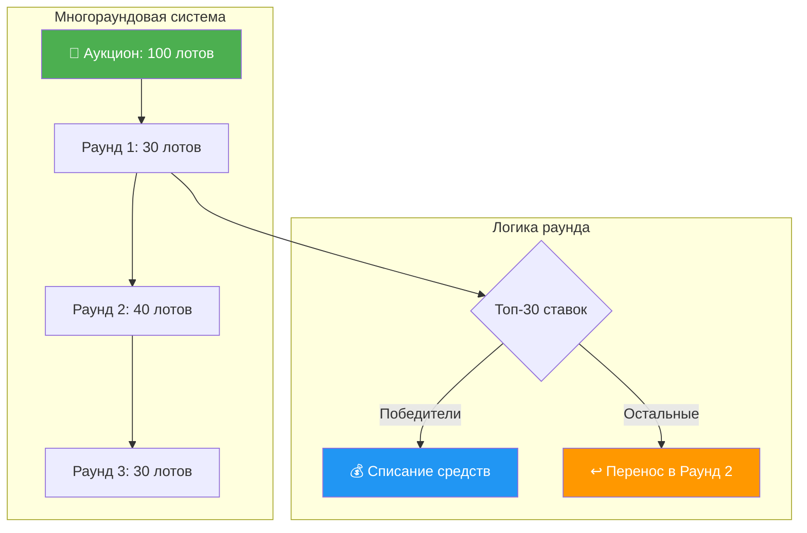
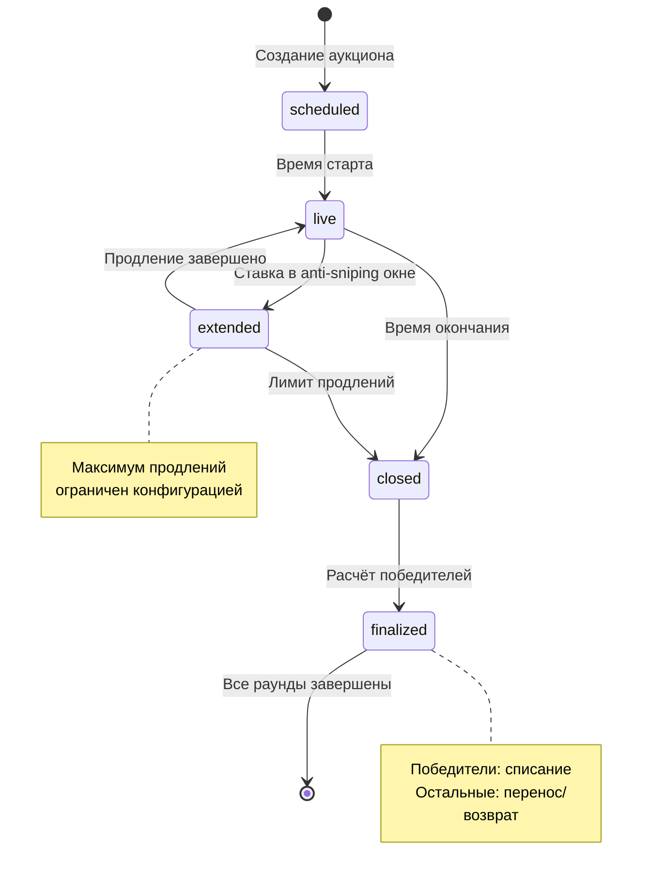
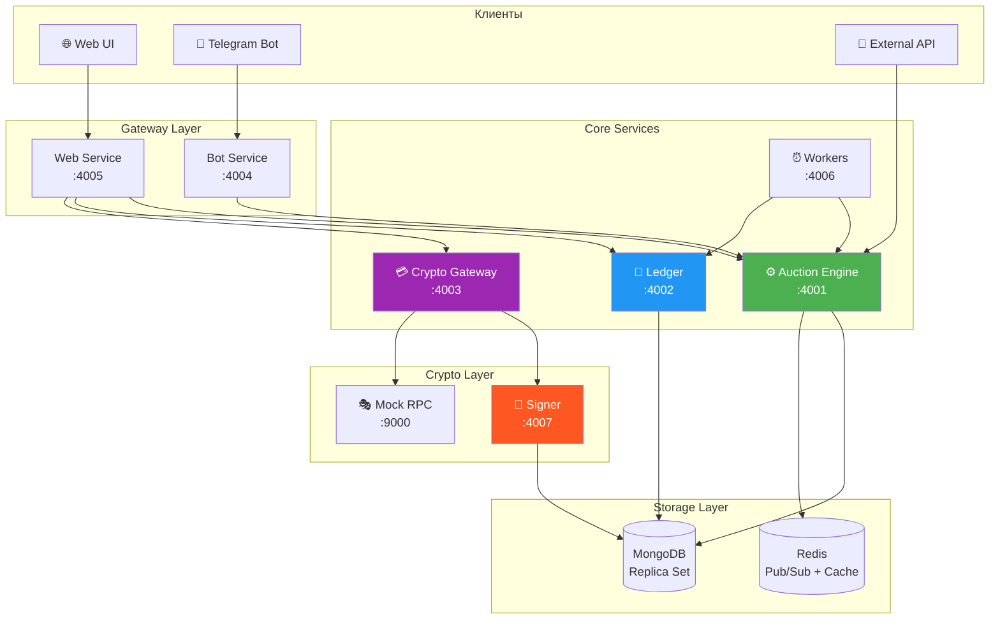
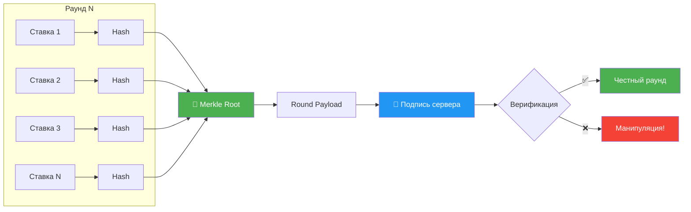
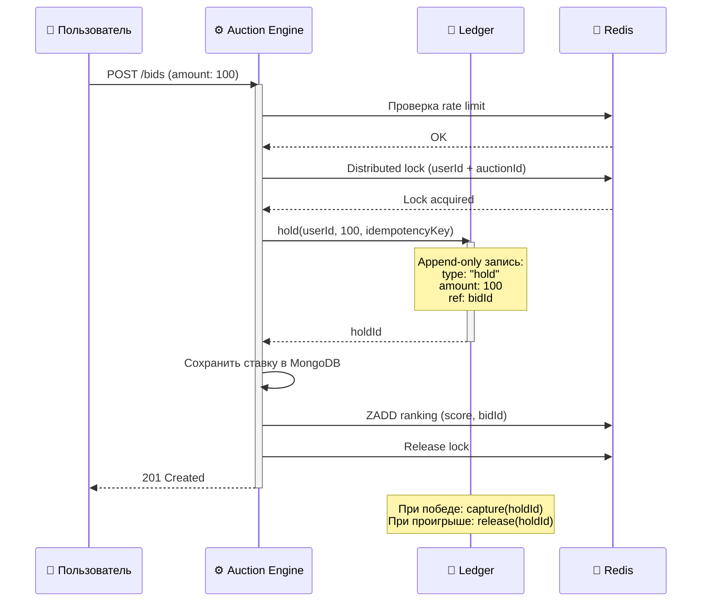
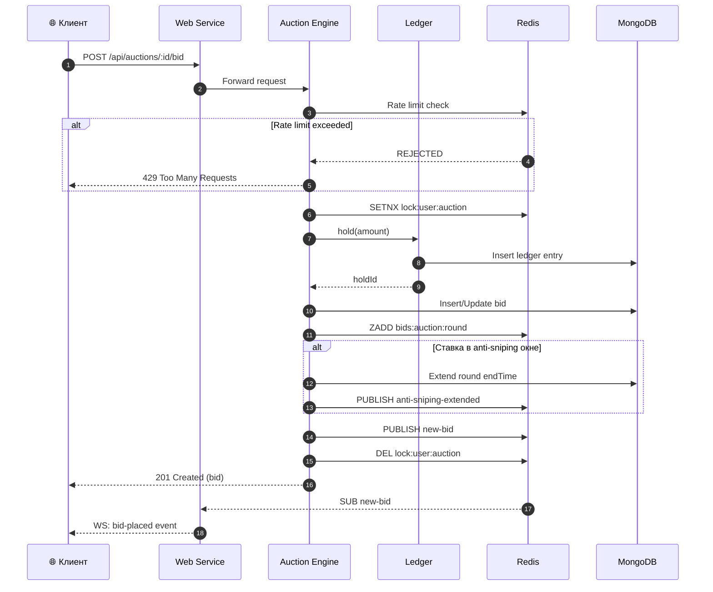
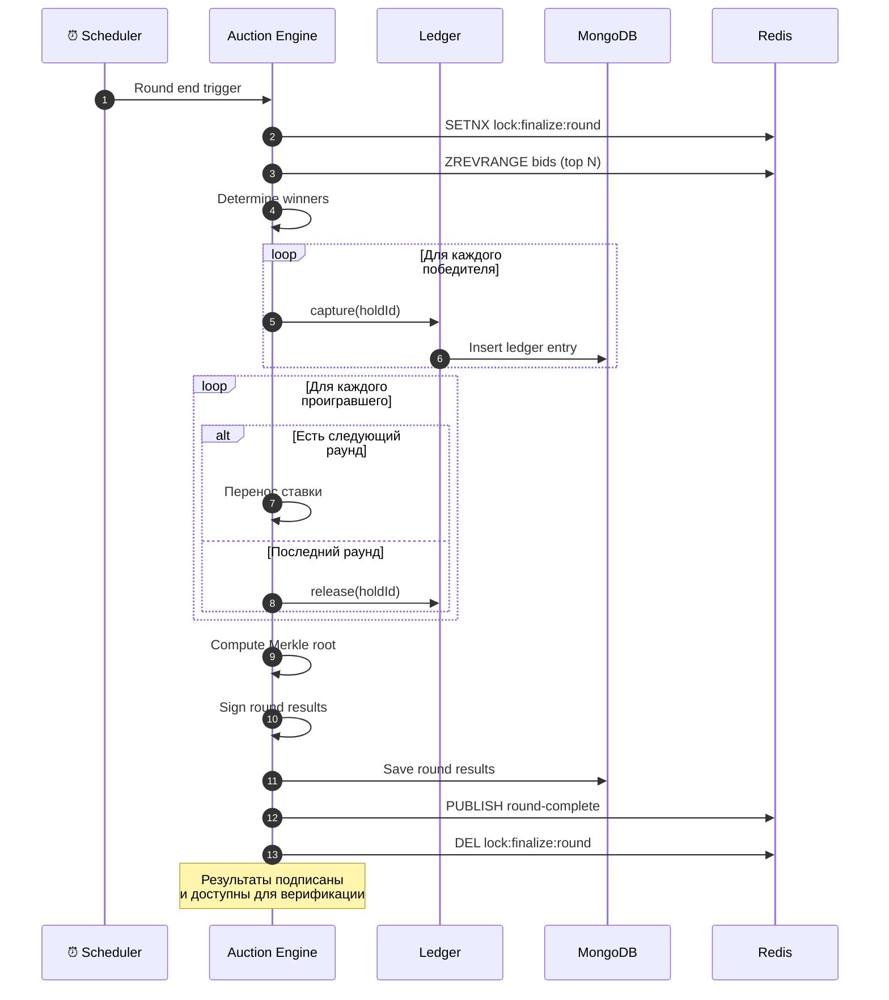
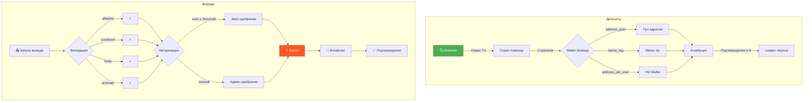
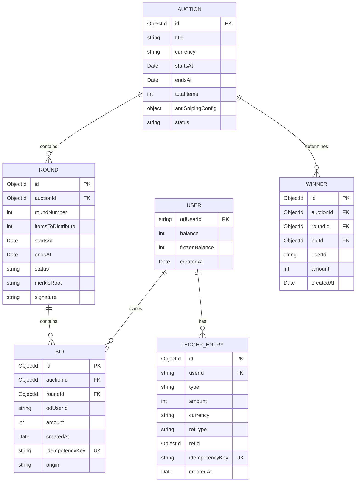
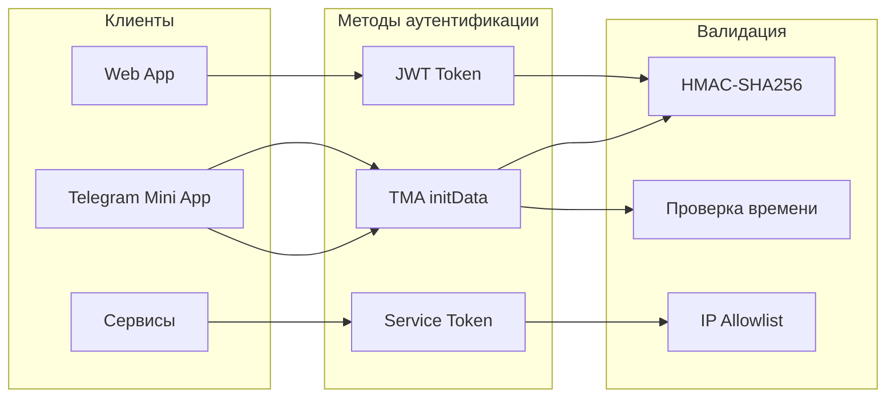

# 🎯 Платформа аукционов Telegram Gift Auctions

> Боевой Telegram-стек для многораундовых крипто-аукционов с криптографической проверяемостью, ledger-first финансами и мгновенными обновлениями.

[](https://nodejs.org/)
[](https://www.typescriptlang.org/)
[](https://www.mongodb.com/)
[](https://redis.io/)
[](https://docs.docker.com/compose/)

---

## 📋 Содержание

- [Понимание механики Telegram Gift Auctions](#понимание-механики)
- [Архитектура системы](#архитектура-системы)
- [Ключевые гарантии](#ключевые-гарантии)
- [Потоки данных](#потоки-данных)
- [Сервисы и порты](#сервисы-и-порты)
- [Доменные сущности](#доменные-сущности)
- [Быстрый старт](#быстрый-старт)
- [API Reference](#api-reference)
- [Нагрузочное тестирование](#нагрузочное-тестирование)
- [Конфигурация](#конфигурация)

---

<a id="понимание-механики"></a>
## 🎮 Понимание механики Telegram Gift Auctions

### Как мы поняли механику

Изучив работу Telegram Gift Auctions, мы выявили ключевые особенности, отличающие её от классических аукционов:



### Наши допущения

| Аспект | Допущение | Обоснование |
|--------|-----------|-------------|
| **Одна ставка на пользователя** | Пользователь имеет одну активную ставку на аукцион | Упрощает UX и предотвращает самоперебивание |
| **Перенос ставок** | Непобедившие ставки автоматически переносятся в следующий раунд | Снижает барьер для продолжения участия |
| **Ранжирование** | Сумма DESC → Время ASC → ID ставки ASC | Детерминированный порядок, раннее время предпочтительнее |
| **Anti-sniping** | Продление раунда при ставках в последние N секунд | Защита от ботов, ставящих в последнюю миллисекунду |
| **Блокировка средств** | Сумма ставки блокируется сразу, списывается при победе | Гарантия платежеспособности победителей |

### Жизненный цикл раунда



---

<a id="архитектура-системы"></a>
## 🏗️ Архитектура системы

### Высокоуровневая архитектура



### Ответственность сервисов

| Сервис | Порт | Ответственность |
|--------|------|-----------------|
| **Auction Engine** | 4001 | CRUD аукционов, ставки, снимки раундов, кэш ранжирования |
| **Ledger** | 4002 | Балансы, hold/capture/release, журнал операций |
| **Crypto Gateway** | 4003 | Депозиты, выводы, проверки безопасности |
| **Bot** | 4004 | Telegram-обработчики, уведомления |
| **Web** | 4005 | HTTP API, WebSocket, статика |
| **Workers** | 4006 | Прогресс раундов, финализация |
| **Signer** | 4007 | Подпись транзакций (локальные ключи / KMS) |
| **Mock RPC** | 9000 | Мок наблюдателя и подписанта для разработки |

---

<a id="ключевые-гарантии"></a>
## 🛡️ Ключевые гарантии

### Криптографическая проверяемость



### Финансовая модель (Ledger-first)



### Гарантии системы

| Гарантия | Реализация |
|----------|------------|
| **Детерминированность** | Одинаковые входные данные → одинаковые результаты |
| **Идемпотентность** | Все денежные операции используют idempotencyKey |
| **Полный аудит** | Журнал append-only для восстановления истории |
| **Проверяемость** | Merkle-корни и подписи раундов |
| **Безопасная конкуренция** | Распределённые блокировки Redis |
| **Изоляция сбоев** | Микросервисы независимы |

---

<a id="потоки-данных"></a>
## 🔄 Потоки данных

### Размещение ставки



### Финализация раунда



### Депозиты и выводы



---

<a id="сервисы-и-порты"></a>
## 🔌 Сервисы и порты

```
┌─────────────────────────────────────────────────────────────────┐
│                     DOCKER COMPOSE STACK                         │
├─────────────────────────────────────────────────────────────────┤
│                                                                  │
│  ┌──────────────┐  ┌──────────────┐  ┌──────────────┐           │
│  │ Auction      │  │ Ledger       │  │ Crypto       │           │
│  │ Engine       │  │              │  │ Gateway      │           │
│  │ :4001        │  │ :4002        │  │ :4003        │           │
│  └──────────────┘  └──────────────┘  └──────────────┘           │
│                                                                  │
│  ┌──────────────┐  ┌──────────────┐  ┌──────────────┐           │
│  │ Bot          │  │ Web UI       │  │ Workers      │           │
│  │              │  │              │  │              │           │
│  │ :4004        │  │ :4005        │  │ :4006        │           │
│  └──────────────┘  └──────────────┘  └──────────────┘           │
│                                                                  │
│  ┌──────────────┐  ┌──────────────┐                             │
│  │ Signer       │  │ Mock RPC     │                             │
│  │              │  │              │                             │
│  │ :4007        │  │ :9000        │                             │
│  └──────────────┘  └──────────────┘                             │
│                                                                  │
│  ┌──────────────────────────────────────────────────┐           │
│  │                   MongoDB :27017                  │           │
│  │                   (Replica Set)                   │           │
│  └──────────────────────────────────────────────────┘           │
│                                                                  │
│  ┌──────────────────────────────────────────────────┐           │
│  │                   Redis :6379                     │           │
│  │                   (Pub/Sub + Cache)               │           │
│  └──────────────────────────────────────────────────┘           │
│                                                                  │
└─────────────────────────────────────────────────────────────────┘
```

---

<a id="доменные-сущности"></a>
## 📦 Доменные сущности



---

<a id="быстрый-старт"></a>
## 🚀 Быстрый старт

### Требования

- Node.js 20+
- Docker & Docker Compose
- Git

### Установка и запуск

```bash
# 1. Клонирование репозитория
git clone https://github.com/your-org/crypto-hackathon.git
cd crypto-hackathon

# 2. Установка зависимостей
npm install

# 3. Запуск всех сервисов
docker compose up -d

# 4. Проверка статуса
docker compose ps

# 5. Открыть Web UI
open http://localhost:4005
```

### Минимальный .env для разработки

```env
CORE_API_TOKEN=dev-core-token
CRYPTO_ADMIN_TOKEN=dev-admin-token
SIGNER_API_TOKEN=dev-signer-token
CRYPTO_SIGNER_TOKEN=dev-signer-token
CRYPTO_SUPPORTED_CURRENCIES=USDT
CRYPTO_USD_RATES=USDT:1
CRYPTO_WALLET_STRATEGY=memo_tag
CRYPTO_MEMO_DEPOSIT_ADDRESS=USDT:DEMO_DEPOSIT_ADDRESS
CRYPTO_HOT_WALLET_ADDRESS=USDT:DEMO_HOT_WALLET
CRYPTO_OBSERVER_URL=mock
CRYPTO_SIGNER_URL=mock
WEB_ALLOW_DEMO_USER=true
```

### Проверка работоспособности

```bash
# Health check
curl http://localhost:4001/health/ready

# Создание тестового аукциона
curl -X POST http://localhost:4005/api/auctions \
  -H "Content-Type: application/json" \
  -H "x-demo-user-id: demo-admin" \
  -d '{
    "title": "Test Auction",
    "currency": "USDT",
    "totalItems": 10,
    "rounds": [
      { "itemsToDistribute": 3, "durationSeconds": 120 },
      { "itemsToDistribute": 4, "durationSeconds": 120 },
      { "itemsToDistribute": 3, "durationSeconds": 120 }
    ]
  }'
```

---

<a id="api-reference"></a>
## 📚 API Reference

### Аутентификация

| Метод | Заголовок | Описание |
|-------|-----------|----------|
| Service Token | `x-service-token: <CORE_API_TOKEN>` | Для межсервисных вызовов |
| Telegram | `Authorization: TMA <initData>` | WebApp аутентификация |
| Demo User | `x-demo-user-id: <userId>` | Только для разработки |

### Основные эндпоинты

#### Аукционы

| Метод | Путь | Описание |
|-------|------|----------|
| `GET` | `/api/auctions` | Список аукционов |
| `GET` | `/api/auctions/:id` | Детали аукциона |
| `POST` | `/api/auctions` | Создание аукциона |
| `POST` | `/api/auctions/:id/bid` | Размещение ставки |
| `GET` | `/api/auctions/:id/leaderboard` | Топ ставок |
| `GET` | `/api/auctions/:id/replay` | Replay раунда |

#### Баланс

| Метод | Путь | Описание |
|-------|------|----------|
| `GET` | `/api/balance` | Текущий баланс пользователя |
| `GET` | `/api/balance/history` | История операций |

#### WebSocket события

```javascript
// Подключение
const ws = new WebSocket('ws://localhost:4005/ws');

// События
ws.onmessage = (event) => {
  const { type, payload } = JSON.parse(event.data);
  
  switch (type) {
    case 'bid-placed':
      // Новая ставка
      break;
    case 'outbid':
      // Вашу ставку перебили
      break;
    case 'round-complete':
      // Раунд завершён
      break;
    case 'anti-sniping':
      // Раунд продлён
      break;
  }
};
```

Полная документация API: [`docs/requests.md`](docs/requests.md)

---

<a id="нагрузочное-тестирование"></a>
## ⚡ Нагрузочное тестирование

### Доступные сценарии

```bash
# Полный набор тестов
npm run load:all

# Отдельные сценарии
npm run load:bot        # Симуляция ботов
npm run load:stress     # Стресс-тест ставок
npm run load:anti-sniping # Тест anti-sniping
npm run load:reconcile  # Проверка финансовой корректности

# Интерактивный CLI
npm run load:perf
```

### Что проверяют тесты

| Сценарий | Проверка |
|----------|----------|
| **bot-sim** | Конкурентные ставки от множества ботов |
| **stress-bids** | Высокая нагрузка одновременных запросов |
| **anti-sniping** | Корректность продления раундов |
| **reconcile** | Сходимость балансов после раундов |

### Метрики

После тестов проверьте:

```bash
# Prometheus метрики
curl http://localhost:4001/metrics

# Финансовая сверка
npm run load:reconcile
```

---

<a id="конфигурация"></a>
## ⚙️ Конфигурация

### Core сервисы

| Переменная | Описание | По умолчанию |
|------------|----------|--------------|
| `NODE_ENV` | Окружение | `development` |
| `SERVICE_NAME` | Имя сервиса | - |
| `HTTP_PORT` | Порт | - |
| `LOG_LEVEL` | Уровень логов | `info` |

### Хранилища

| Переменная | Описание |
|------------|----------|
| `MONGO_URI` | MongoDB connection string |
| `MONGO_DB` | Имя базы данных |
| `REDIS_URL` | Redis connection string |

### Rate Limits

| Переменная | Описание | По умолчанию |
|------------|----------|--------------|
| `RATE_LIMIT_USER_PER_SECOND` | Лимит на пользователя | `5` |
| `RATE_LIMIT_AUCTION_USER_PER_SECOND` | Лимит на пользователя в аукционе | `3` |
| `RATE_LIMIT_IP_PER_SECOND` | Лимит на IP | `20` |

### Anti-Sniping

| Переменная | Описание | По умолчанию |
|------------|----------|--------------|
| `ANTI_SNIPING_WINDOW_SECONDS` | Окно детекции | `30` |
| `ANTI_SNIPING_EXTENSION_SECONDS` | Продление | `30` |
| `ANTI_SNIPING_MAX_EXTENSIONS` | Максимум продлений | `5` |

### Crypto Gateway

| Переменная | Описание |
|------------|----------|
| `CRYPTO_SUPPORTED_CURRENCIES` | Список валют (USDT) |
| `CRYPTO_WALLET_STRATEGY` | Стратегия: `address_pool`, `memo_tag`, `address_per_user` |
| `CRYPTO_OBSERVER_URL` | URL наблюдателя или `mock` |
| `CRYPTO_SIGNER_URL` | URL подписанта или `mock` |

### Выводы

| Переменная | Описание |
|------------|----------|
| `CRYPTO_WITHDRAWAL_MIN_AMOUNT` | Минимальная сумма |
| `CRYPTO_WITHDRAWAL_MAX_AMOUNT` | Максимальная сумма |
| `CRYPTO_WITHDRAWAL_DAILY_LIMIT` | Дневной лимит |
| `CRYPTO_WITHDRAWAL_COOLDOWN_SECONDS` | Cooldown между выводами |
| `CRYPTO_WITHDRAWAL_ALLOWLIST_REQUIRED` | Требовать allowlist |

---

## 🔒 Безопасность

### Модель аутентификации



### Защитные механизмы

- ✅ **CSRF защита** — проверка Origin для небезопасных методов
- ✅ **Rate Limiting** — на пользователя, аукцион и IP
- ✅ **Distributed Locks** — предотвращение race conditions
- ✅ **Idempotency Keys** — защита от дублирования операций
- ✅ **IP Allowlist** — для критичных сервисов (Signer)
- ✅ **KMS интеграция** — опциональное хранение ключей

---

## 📈 Мониторинг

Каждый сервис предоставляет:

```bash
# Liveness probe
GET /health/live

# Readiness probe (включает проверки зависимостей)
GET /health/ready

# Prometheus метрики
GET /metrics
```

### Ключевые метрики

- `http_requests_total` — общее количество запросов
- `http_request_duration_seconds` — латентность
- `bids_total` — количество ставок
- `rounds_finalized_total` — завершённые раунды
- `ledger_operations_total` — операции с балансами

---

## 🤝 Вклад в проект

1. Fork репозитория
2. Создайте feature branch: `git checkout -b feature/amazing-feature`
3. Commit изменений: `git commit -m 'Add amazing feature'`
4. Push в branch: `git push origin feature/amazing-feature`
5. Откройте Pull Request

---

## 📄 Лицензия

MIT License — см. [LICENSE](LICENSE) для деталей.

---

## 📞 Контакты

- **Telegram**: [@your_username](https://t.me/your_username)
- **Email**: your@email.com

---

<div align="center">
  <sub>Built with ❤️ for Telegram Gift Auctions Hackathon</sub>
</div>
